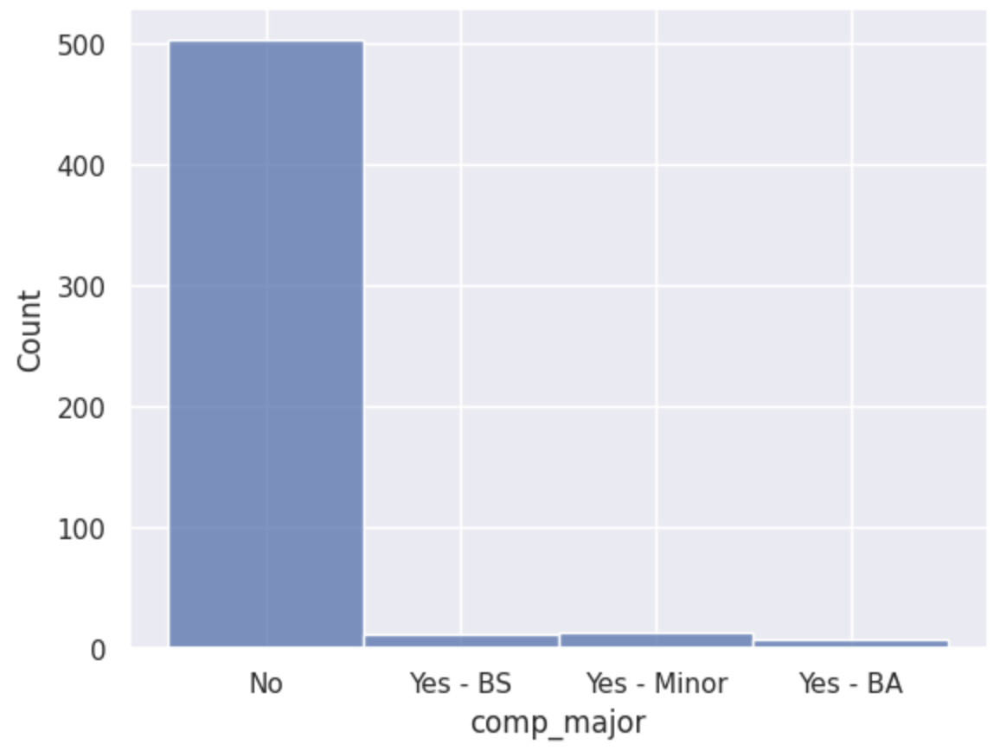
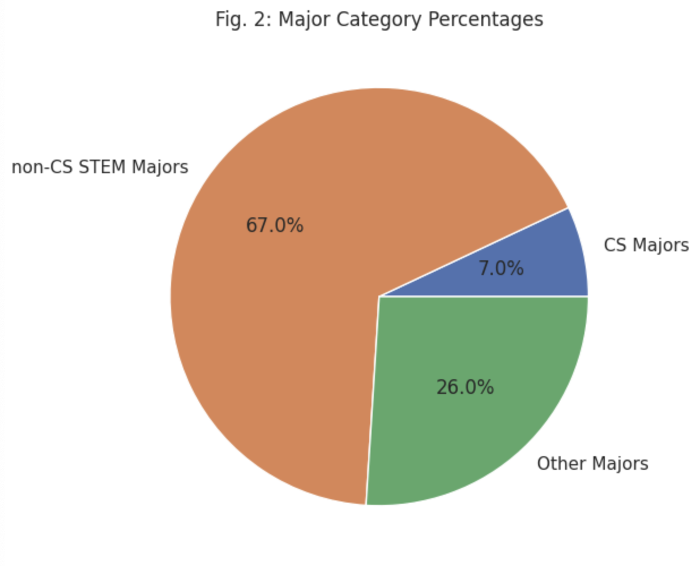
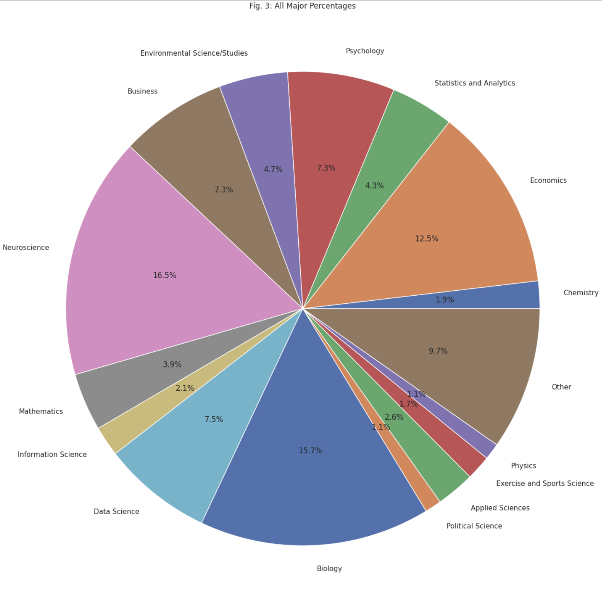

---
# Do not edit the text between these lines!
layout: default
---

# Majors Taking COMP110

<!-- This is a comment. Below, you'll see code for inserting an image. To make this image appear, update <custom-path>. To add an image, save it inside the imgs folder of this repository. -->

## The Results

For this study, we will survey students who intend to or are currently majoring in computer science, then count the number of students who intend to or are majoring in a non-computer science STEM course. For our purposes, such courses are defined as:
Applied Sciences
Biomedical Engineering
Biostatistics
Chemistry
Clinical Lab Science
Data Science
Earth Science
Economics
Environmental Science/Studies
Environmental Health Sciences
Geology
Information Science
Mathematics
Neuroscience
Nursing
Physics
Psychology
Radiology
Sociology
Statistics and Analytics
In public discourse, a number of these majors chosen are at times not labeled as STEM. However, for the purposes of this survey, we chose majors that require a large amount of quantitative analysis in its course requirements and job prospects.
Conclusions

This study collected data via a survey of COMP110 peers to determine the most common majors amongst enrolled students. With the information gathered, we can make informed decisions that would benefit the most students enrolled. For this survey, we propose the integration of targeted data sets into the course’s structure and main topics, making it a more applicable topic for STEM-oriented students.

The histogram displayed shows that most students in COMP110 are not designated as or planning on adding a computer science major to their degree at UNC. Instead, majors such as neuroscience, biology, and economics are prominently featured in COMP110 courses in addition to computer science students. More integrated learning taking basic concepts from those fields may make a COMP110 class have more significance to those prominent cohorts.
In the future, instructors for COMP110 courses should think about collecting more surveys detailing what specialized topics students would find interesting in applying computer science principles. Perhaps these changes will be little more than surface level, but it may make the course seem more immediately reachable to many STEM students. The trade off from this could be that specializing may be isolating to some majors over others, and instructional staff may not know how to immediately apply principles from other majors of instruction to computer science classes.

